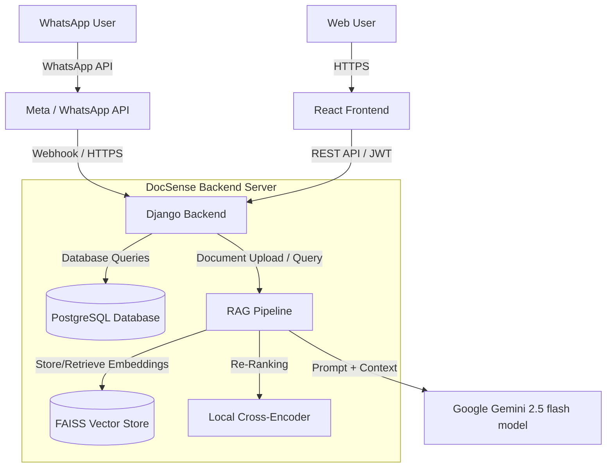

# High-Level Architecture (HLA)

DocSense is built on a modern, decoupled architecture. The system integrates a React frontend, a Django backend, a WhatsApp Webhook interface, and a robust Retrieval-Augmented Generation (RAG) pipeline powered by Google Gemini and HuggingFace.

## System Components

## Architectural Layers

1. **Presentation Layer (Frontend)**: 
   - A React-based Single Page Application (SPA) providing a web dashboard for users to authenticate, upload documents, chat with the AI, and configure WhatsApp settings.
   - Built with Vite, Tailwind CSS v4, and React Router.

2. **Application Layer (Backend API)**:
   - Built with Django and Django REST Framework.
   - Exposes RESTful endpoints for frontend consumption.
   - Handles multi-tenant organization logic, user authentication (SimpleJWT), and file management.

3. **WhatsApp Interface Layer**:
   - Webhook endpoints designed to receive incoming messages from the Meta WhatsApp Cloud API.
   - Automatically verifies tokens, parses incoming user texts, routes them to the RAG pipeline, and sends responses back to the user's WhatsApp number.

4. **AI & Intelligence Layer (RAG)**:
   - **Ingestion**: Parses documents, dynamically chunks text based on document type, creates vector embeddings (HuggingFace), and stores them (FAISS).
   - **Retrieval**: Fetches relevant chunks using FAISS, re-ranks them using a local Cross-Encoder to guarantee extreme precision, and feeds the top chunks into Google Gemini to generate human-like answers.

5. **Data Layer**:
   - **Relational Data**: PostgreSQL stores Users, Organizations, Document metadata, Chat Histories, and WhatsApp Configurations.
   - **Vector Data**: FAISS stores dense vector embeddings on disk. Files are physically stored on the server (`/media/`).
